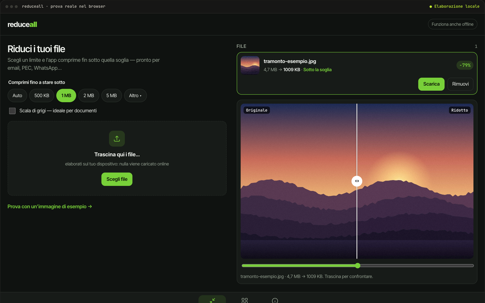

# ReduceAll

> File troppo pesante per la PEC? Scegli il limite e ReduceAll comprime fin sotto la soglia, sul tuo dispositivo, senza caricare nulla.

`08` · **Progetto personale · PWA** · 2026 · Ideazione e sviluppo

[**▶ Prova la demo**](https://portfolio.lele-tradevalue.com/progetti/reduceall/#demo) · [Caso studio completo](https://portfolio.lele-tradevalue.com/progetti/reduceall/) · [English version](https://portfolio.lele-tradevalue.com/en/progetti/reduceall/)

## Il problema

Email, PEC, moduli online: ognuno ha il suo limite di dimensione, e i siti che comprimono chiedono di caricare documenti che spesso sono personali.

## Cosa ho costruito

ReduceAll è una PWA che lavora in locale: scegli un obiettivo — 2 MB, PEC, WhatsApp — e l’app abbassa qualità e risoluzione per tentativi finché il file ci sta. Comprime immagini e PDF con moduli WebAssembly in un worker separato, converte formati, unisce e divide PDF, toglie i metadati di posizione. Funziona anche offline.

## Come funziona

1. **Scegli la soglia** — Un valore o un preset: email, PEC, WhatsApp, modulo web.
2. **Compressione per tentativi** — Qualità prima, poi risoluzione, fino a stare sotto.
3. **Tutto in locale** — WebAssembly in un Web Worker: l’interfaccia resta fluida.
4. **Salva o condividi** — Dal telefono si apre direttamente il menu di condivisione.

## Perché funziona

- **Privacy per costruzione.** Il file non lascia mai il dispositivo.
- **Un obiettivo, non una percentuale.** Dici dove deve arrivare il file, non quanto comprimerlo.
- **Funziona offline.** Installabile come app, anche senza rete.
- **Più strumenti in uno.** Scansione in PDF, conversioni, metadati, PDF da unire o dividere.

## In numeri

| | |
|---:|---|
| **10+** | strumenti |
| **0** | file caricati online |
| **100%** | nel browser |

## Stack

`React` `TypeScript` `WebAssembly` `Web Workers` `PWA`

## Cosa resta privato

La prova comprime davvero le immagini, sul tuo dispositivo. PDF e video sono nell’app completa. Questo repository contiene solo la presentazione del progetto: niente codice sorgente, cronologia o configurazioni.

<b>In English</b>

**ReduceAll** — File too big for that email? Pick the limit and ReduceAll compresses until it fits, on your device, without uploading anything.

ReduceAll is a PWA that works locally: pick a target — 2 MB, certified email, WhatsApp — and the app lowers quality and resolution step by step until the file fits. It compresses images and PDFs with WebAssembly modules in a separate worker, converts formats, merges and splits PDFs, and strips location metadata. It also works offline.

- **Private by design.** The file never leaves your device.
- **A target, not a percentage.** You say where the file has to go, not how much to squeeze it.
- **Works offline.** Installable as an app, even without a connection.
- **Many tools in one.** Scan to PDF, conversions, metadata, merge or split PDFs.

[Read the full case study and try the demo →](https://portfolio.lele-tradevalue.com/en/progetti/reduceall/)

---

Emanuele Montalto · [portfolio](https://portfolio.lele-tradevalue.com) · [LinkedIn](https://www.linkedin.com/in/emanuele-montalto/) · [montalto36@gmail.com](mailto:montalto36@gmail.com)
